<div align="center">


# ⭐ Java Pattern Printing Collection

### Master Java Pattern Printing with 25+ Beginner to Intermediate Pattern Programs

<p>
  
  
  
  
  
</p>

<p>
  
  
  
  
</p>

A comprehensive collection of **Java Pattern Printing Programs** designed to strengthen programming fundamentals, logical thinking, and mastery of nested loops. This repository covers **star patterns, number patterns, hollow patterns, pyramids, Pascal's Triangle, butterfly patterns, X patterns, and more**, along with output screenshots for easy understanding.

</div>

---

# 📚 Repository Topics

**Java • Pattern Printing • DSA • Nested Loops • Java Programming • Logic Building • Star Patterns • Number Patterns • Pyramid Patterns • College Lab Programs • Coding Interview Preparation • Beginner Friendly**

---

# 📑 Table of Contents

- 📌 About
- ✨ Features
- 📂 Repository Structure
- 📖 Patterns Included
- 🖼️ Pattern Gallery
- 🚀 Getting Started
- 💡 Concepts Covered
- 🛠️ Technologies Used
- 🤝 Contributing
- ⭐ Support

---

# 📌 About

Pattern printing is one of the best ways to strengthen programming logic and develop a deeper understanding of nested loops and conditional statements.

This repository contains **25+ carefully organized Java Pattern Printing Programs**, each implemented using clean, beginner-friendly code. Every pattern includes a corresponding output screenshot, making it easier to understand the expected output before running the program.

Whether you're preparing for **college practicals**, **coding interviews**, or simply improving your Java skills, this repository serves as a handy reference.

---

# ✨ Features

- ⭐ 25+ Java Pattern Printing Programs
- 📷 Output screenshots for every pattern
- 📂 Well-organized folder structure
- 🧠 Beginner-friendly implementations
- 💻 Pure Java (No external libraries)
- 📚 Great for Java beginners
- 🎯 Ideal for DSA and logic-building practice
- 🔄 Covers both star and number patterns

---

# 📂 Repository Structure

```text
PATTERN_PRINTING
│
├── butterfly_pattern
├── diamond_pattern
├── hollow_diamond_pyramid
├── hollow_hourglass
├── hollow_triangle_pattern
├── k_pattern
├── left_triangle_pattern
├── mirror_image_pattern
├── number_changing_pattern
├── number_increasing_pyramid
├── number_increasing_reverse_pyramid
├── number_triangle_pattern
├── parallelogram_pattern
├── pattern_1
├── reverse_diamond_pattern
├── reverse_hollow_triangle
├── reverse_left_half_pyramid
├── reverse_number_triangle_pattern
├── reverse_right_half_pyramid
├── right_half_pyramid
├── right_pascals_triangle
├── square_hollow
├── triangle_pattern
├── x_pattern
├── zero_one_pattern
│
├── screenshots
└── README.md
```

---

# 📖 Patterns Included

| No | Pattern |
|:--:|---------|
| 1 | Pattern 1 |
| 2 | Triangle Pattern |
| 3 | Hollow Triangle Pattern |
| 4 | Left Triangle Pattern |
| 5 | Right Half Pyramid |
| 6 | Reverse Right Half Pyramid |
| 7 | Reverse Left Half Pyramid |
| 8 | Number Triangle Pattern |
| 9 | Reverse Number Triangle Pattern |
| 10 | Number Increasing Pyramid |
| 11 | Number Increasing Reverse Pyramid |
| 12 | Number Changing Pattern |
| 13 | Square Hollow |
| 14 | Diamond Pattern |
| 15 | Hollow Diamond Pyramid |
| 16 | Reverse Diamond Pattern |
| 17 | Butterfly Pattern |
| 18 | Mirror Image Pattern |
| 19 | Hollow Hourglass |
| 20 | K Pattern |
| 21 | X Pattern |
| 22 | Zero-One Pattern |
| 23 | Parallelogram Pattern |
| 24 | Right Pascal's Triangle |
| 25 | Reverse Hollow Triangle |

---

# 🖼️ Pattern Gallery

| Butterfly | Diamond |
|------------|---------|
| 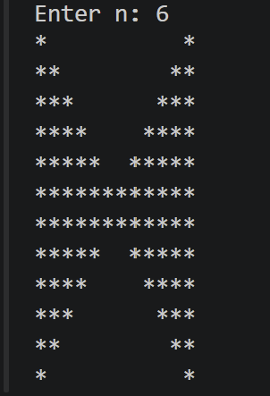 | 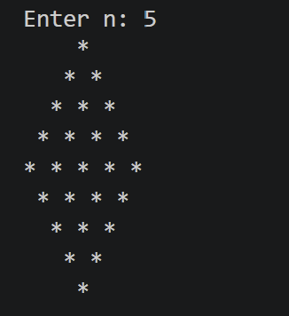 |

| Hollow Diamond | Hollow Hourglass |
|----------------|------------------|
| 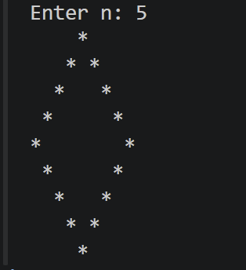 | 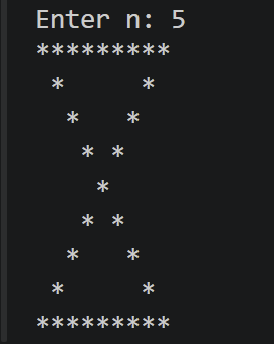 |

| Hollow Triangle | K Pattern |
|-----------------|-----------|
| 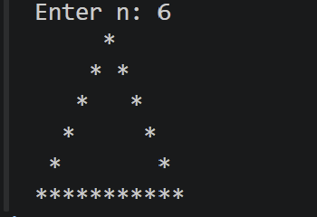 | 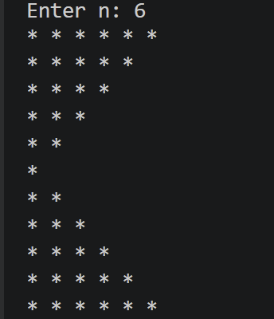 |

| Left Triangle | Mirror Image |
|---------------|--------------|
| 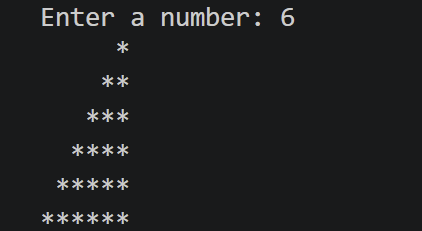 | 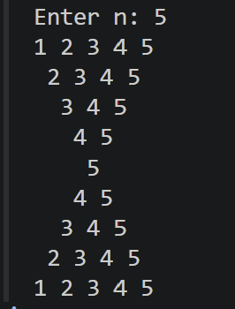 |

| Number Changing | Number Increasing |
|-----------------|-------------------|
| 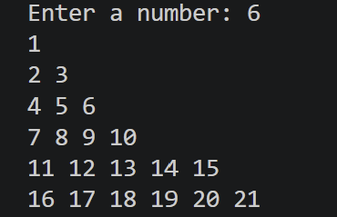 | 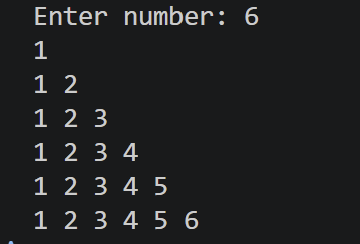 |

| Number Increasing Reverse | Number Triangle |
|----------------------------|-----------------|
| 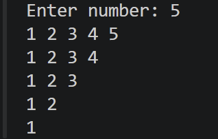 | 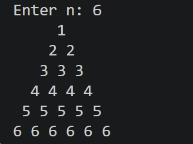 |

| Parallelogram | Pattern 1 |
|---------------|-----------|
| 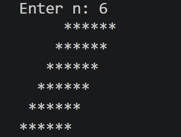 | 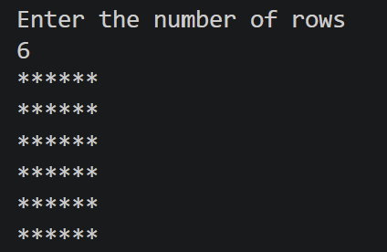 |

| Reverse Diamond | Reverse Hollow Triangle |
|-----------------|-------------------------|
| 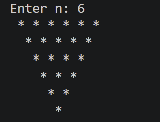 | 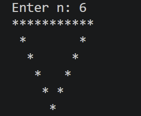 |

| Reverse Left Half | Reverse Right Half |
|-------------------|--------------------|
| 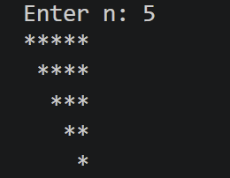 | 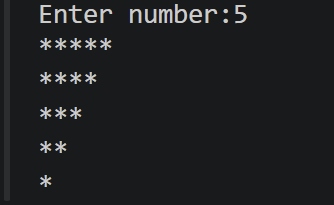 |

| Reverse Number Triangle | Right Half Pyramid |
|--------------------------|--------------------|
| 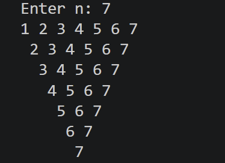 | 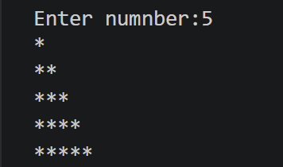 |

| Right Pascal's Triangle | Square Hollow |
|--------------------------|----------------|
| 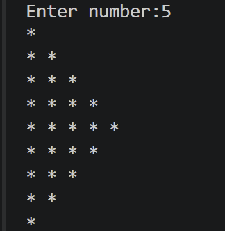 | 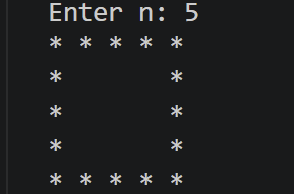 |

| Triangle Pattern | X Pattern |
|------------------|-----------|
| 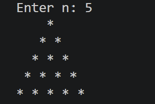 |  |

| Zero-One Pattern |
|------------------|
| 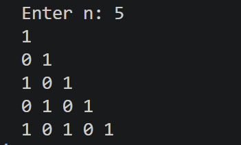 |

---

# 🚀 Getting Started

## Clone the Repository

```bash
git clone https://github.com/asif-visionary/pattern_printing.git
```

## Navigate to the Project

```bash
cd pattern_printing
```

```bash
cd FolderName
```

## Compile

```bash
javac FileName.java
```

## Run

```bash
java FileName
```

---

# 💡 Concepts Covered

- Nested Loops
- Conditional Statements
- Star Patterns
- Number Patterns
- Hollow Patterns
- Pyramid Patterns
- Symmetric Patterns
- Pattern Logic
- Java Fundamentals
- Console Output Formatting

---

# 🛠️ Technologies Used

- Java
- VS Code
- Git
- GitHub

---

# 🤝 Contributing

Contributions are always welcome!

If you'd like to add more Java pattern programs or improve existing implementations:

1. Fork this repository
2. Create a new branch
3. Commit your changes
4. Push to your fork
5. Open a Pull Request

---

# ⭐ Support

If this repository helped you learn Java Pattern Printing or improve your programming skills, consider giving it a **⭐ Star**. It motivates me to create and share more educational repositories.

---

<div align="center">

### 🌟 Happy Coding! 🌟

Made with ❤️ by **Asif**

</div>